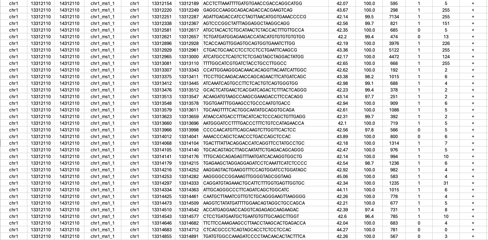

**Please upload .bed files, preferably without a header (column names), with the following columns in this order: id_chr, id_start, id_end, id, chr, start, end, sequence, "Tm", "on_target", "off_target", "is_repeat", "prob", "max_kmer", "probe_strand" (Max. file size 1GB).**

##### **Example file**

#### Universal sequences

Universal sequences are typically used to amplify the Oligopaints library. 

Things to consider when selecting universal sequence:
- PCR reaction pairs to amplify libraries or sublibraries
- Universal sequences can be used to to do a fast check of the library quality
- They could also be used to divide a big library into smaller sublibraries

#### Mainstreet sequence(s)

Mainstreet sequences are the sequences that are typically used to select specific genomic segments. These segments can be images sequentially or all at once with a multiplex imaging method.
You can use up to two Mainstreet sequences based on the complexity and genomic resolution of your experiment. You do not need to use both Mainstreet1 and Mainstreet2.

#### Backstreet sequence(s)

Backstreet sequences are the sequences that are typically used to select specific genomic segments. These segments can be images sequentially or all at once with a multiplex imaging method.
You can use up to two Backstreet sequences based on the complexity and genomic resolution of your experiment. You do not need to use both Backstreet1 and Backstreet2.

You can opt to use the exact same sequence for as the Mainstreet. This is useful when you want to increase the signal of each chromatin segment.
